# Miniony

Na naszym serwerze możecie zdobyć miniony które znacznie ułatwią wam rozgrywkę

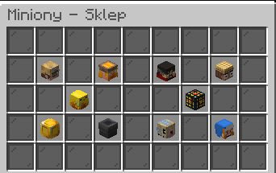

# Panel

Wpisując komende /minions oraz w "moje miniony" wyswietli wam sie cały panel w którym możecie personalizowac, ulepszać oraz karmić swojego miniona
###### Panel danego miniona możecie również otworzyc poprzez kliknięcie go prawym przyciskiem myszy

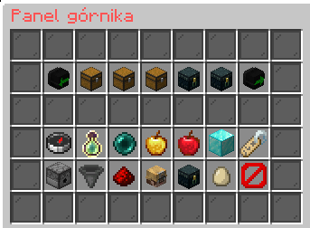

# Typy minionów

### Górnik 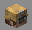

- Ten minion potrzebuje generatora stona przed sobą aby kopać ci itemki

### Zabójca 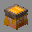

- Ten minion zabija wszystkie moby w swoim pobliżu

### Lekarz 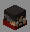

- Ten minio leczy wszystkie inne posiadne przez ciebie miniony na wyspie

### Farmer  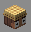

- Ten minion zajmuje się uprawą roli

### Dokarmiacz 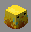

- Ten minion dokarmia wszystkie inne posiadne przez ciebie miniony na wyspie

### Rodziciel 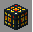

- Ten minion respi wybranego przez was moba z jego menu 

### Sprzedawca 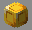

- Tego miniona musicie połaczeć ze skrzynką z której chcecie aby sprzedawał wam wszystkie itemy

### Zbieracz 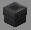

- Ten minion zbiera wszystkie itemy z ziemi które znajdują się w jego pobliżu

### Rybak 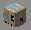

- Ten minion potrzebuje posiadać wodę pod sobą aby łowić ci rybki

### Drwal 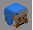

- Ten minion będzie rąbał wam drzewa znajdujace sie w jego pobliżu