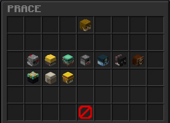
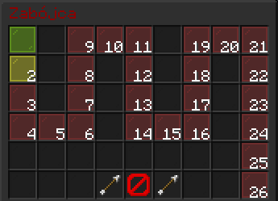
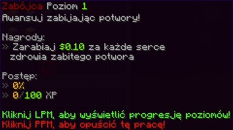
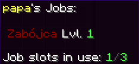

# Prace 

Na naszym serwerze można wybrac prace. Prace można ulepszać aż do 50 poziomu. Im wyższy poziom, tym większe wynagrodzenie za wykonywanie pracy.

# Panel

 **•** Prace można ulepszać poprzez wykonywanie swojej profesji.

 **•** Aby wybrac prace wystarczy kliknąć lewym przyciskiem myszy na interesującą cie prace.

 • Aby zobaczyć zarobki następnych poziomów wystarczy nacisnąć LPM (na prace którą już wykonujesz)

 • Aby opuścić aktualną prace wystarczy kliknąć PPM na daną prace

• Aktualne prace znajdziesz najeżdżając na swoją główkę w panelu

• Poziomy aktualnych prac również znajdziesz najeżdżając na swoją główkę lub daną prace

# Komendy
• Aby otworzyć gui prac, użyj /praca